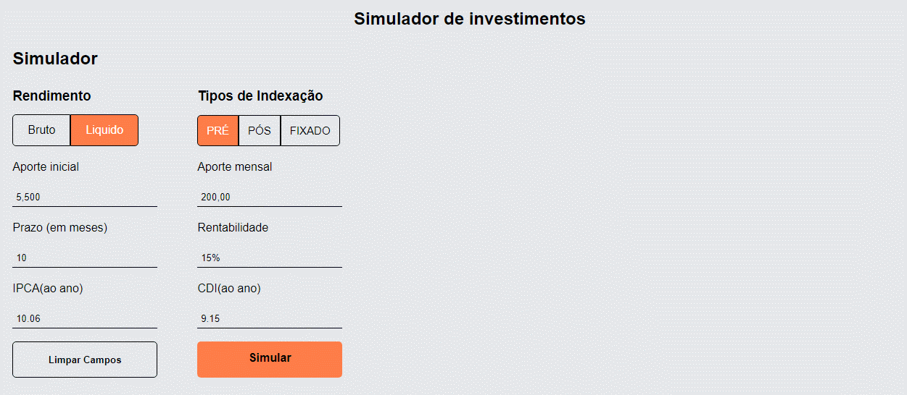
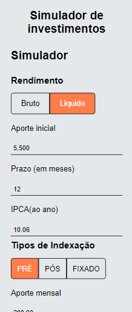

# 💼 Simulador de Investimentos 💼
Uma aplicação front-end que simula investimentos , criada para realização do desafio da EQI Investimentos.
## Fast View

## Mobile View

## Como rodar o projeto:

### `npm run start`

Roda o projeto em modo desenvolvimento.\
Abra [http://localhost:3005](http://localhost:3005) no seu navegador para visualizar.

caso queira rodar a aplicação em outra porta, apenas use o arquivo .env disponivel.

### `docker-compose up --build`

Irá construir e  subir o container automaticamente na porta 3000.\
Abra [http://localhost:3000](http://localhost:3005) no seu navegador para poder visualizar.

## Testes automatizados:
### `npm run test`

Executas todos os testes unitarios da aplicação.

### `npm run cypress`

executa o cypress e detecta automaticamente os testes e2e da aplicação.

## 💡 Tecnologias usadas:

- ReactJs
- Styled-components
- Docker
- Cypress
- Jest
